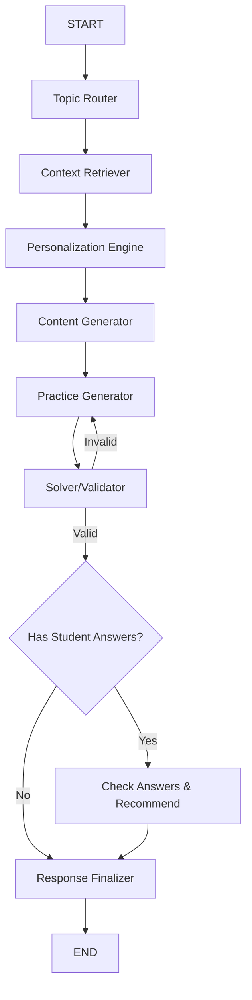

# Mriia AI Tutor - Implementation Plan

## Overview

Build an AI-powered educational tutor for Ukrainian 8th-9th grade students using **LangGraph** for agent orchestration. The system handles the complete cycle:

```
Teacher Request → Topic Routing → Content → Tests → Student Answers → Verification → Recommendations
```

### Key Technologies
- **LangGraph** - Agent orchestration
- **ChromaDB** - Vector database for semantic search
- **Phoenix** - Observability & tracing (required)
- **Lapa LLM** - Content generation (12B Instruct)
- **MamayLM** - Topic routing, practice, solving (12B Gemma-3 Instruct)
- **Qwen Embeddings** - `text-embedding-qwen` for query embeddings

### LLM API (OpenAI-compatible)
```
Base URL: http://146.59.127.106:4000
Models: lapa, mamay, lapa-function-calling, text-embedding-qwen
Auth: Team API Key (LAPATHON_API_KEY)
```

### Key Metrics
- **Private Benchmark**: Accuracy on `lms_questions` (CodaBench)
- **Demo Quality**: Pedagogical correctness, grounding, personalization

---

## Project Structure

```
Groke-Lapa/
├── docker-compose.yml
├── Dockerfile
├── requirements.txt
├── README.md
├── .env.example
│
├── src/
│   ├── __init__.py
│   ├── main.py                    # FastAPI entry point
│   ├── config.py                  # Environment & settings
│   ├── tracing.py                 # Phoenix tracing setup
│   │
│   ├── data/
│   │   ├── __init__.py
│   │   ├── loader.py              # Parquet data loaders
│   │   └── vector_store.py        # ChromaDB vector database
│   │
│   ├── agents/
│   │   ├── __init__.py
│   │   ├── graph.py               # LangGraph workflow definition
│   │   ├── state.py               # Shared state schema
│   │   ├── topic_router.py        # Topic routing (Mamay)
│   │   ├── context_retriever.py   # KB retrieval with ChromaDB
│   │   ├── personalization.py     # Student profile adaptation
│   │   ├── content_generator.py   # Lecture content (Lapa)
│   │   ├── practice_generator.py  # Test generation (Mamay)
│   │   ├── solver.py              # Answer solving & validation
│   │   └── recommendations.py     # Learning recommendations
│   │
│   ├── llm/
│   │   ├── __init__.py
│   │   ├── lapa.py                # Lapa LLM client
│   │   └── mamay.py               # MamayLM client
│   │
│   └── benchmark/
│       ├── __init__.py
│       ├── solver.py              # Benchmark test solver
│       └── evaluate.py            # Accuracy evaluation
│
├── tests/
│   └── test_pipeline.py
│
└── data/                          # Symlink to parquet files
    └── Lapathon2026 Mriia public files/
```

---

## Proposed Changes

### Core Infrastructure

#### [NEW] [docker-compose.yml](file:///Users/olegchovganiuk/Projects/Lapathon/Groke-Lapa/docker-compose.yml)
Docker Compose for reproducible deployment:
```yaml
services:
  api:
    build: .
    ports:
      - "8000:8000"
    environment:
      - PHOENIX_COLLECTOR_ENDPOINT=http://phoenix:6006/v1/traces
      - CHROMA_PERSIST_DIR=/data/chroma_db
    volumes:
      - ./data:/data
      - chroma_data:/data/chroma_db
    depends_on:
      - phoenix

  phoenix:
    image: arizephoenix/phoenix:latest
    ports:
      - "6006:6006"  # Phoenix UI
    volumes:
      - phoenix_data:/phoenix_data

volumes:
  chroma_data:
  phoenix_data:
```
- Environment variables for LLM API keys

#### [NEW] [requirements.txt](file:///Users/olegchovganiuk/Projects/Lapathon/Groke-Lapa/requirements.txt)
Dependencies:
- `langgraph` - Agent orchestration
- `langchain` - LLM abstraction
- `fastapi` + `uvicorn` - API server
- `pandas` + `pyarrow` - Data loading
- `chromadb` - Vector database
- `arize-phoenix` + `openinference-instrumentation-langchain` - Tracing (required)
- `opentelemetry-sdk` + `opentelemetry-exporter-otlp` - Telemetry export

---

### Observability Layer (Required)

#### [NEW] [tracing.py](file:///Users/olegchovganiuk/Projects/Lapathon/Groke-Lapa/src/tracing.py)
Phoenix tracing setup with OpenTelemetry:
```python
import phoenix as px
from phoenix.otel import register
from openinference.instrumentation.langchain import LangChainInstrumentor

def init_tracing():
    # Launch Phoenix (or connect to external)
    px.launch_app()  # Local UI at http://localhost:6006
    
    # Register tracer provider
    tracer_provider = register(
        project_name="mriia-tutor",
        endpoint="http://localhost:6006/v1/traces"  # Phoenix collector
    )
    
    # Instrument LangChain/LangGraph
    LangChainInstrumentor().instrument(tracer_provider=tracer_provider)
```

This enables:
- Full trace visibility for each agent step
- LLM call latency and token usage
- Embedding and retrieval performance
- Error debugging across the pipeline

---

### Data Layer

#### [NEW] [loader.py](file:///Users/olegchovganiuk/Projects/Lapathon/Groke-Lapa/src/data/loader.py)
Load and cache parquet files:
- `load_toc()` - Topics/subtopics with embeddings
- `load_pages()` - Book pages with embeddings
- `load_questions()` - Benchmark questions
- `load_student_scores(student_id)` - Student grades
- `load_student_absences(student_id)` - Student absences

#### [NEW] [vector_store.py](file:///Users/olegchovganiuk/Projects/Lapathon/Groke-Lapa/src/data/vector_store.py)
ChromaDB vector database for semantic search:
```python
import chromadb
from chromadb.config import Settings

class VectorStore:
    def __init__(self, persist_dir: str = "./chroma_db"):
        self.client = chromadb.PersistentClient(
            path=persist_dir,
            settings=Settings(anonymized_telemetry=False)
        )
        self.pages_collection = self.client.get_or_create_collection(
            name="pages",
            metadata={"hnsw:space": "cosine"}
        )
        self.topics_collection = self.client.get_or_create_collection(
            name="topics",
            metadata={"hnsw:space": "cosine"}
        )
    
    def index_from_parquet(self, pages_df, toc_df):
        """Load pre-computed embeddings into ChromaDB"""
        # Index pages with their embeddings
        self.pages_collection.add(
            ids=[...],
            embeddings=[...],  # page_text_embedding
            documents=[...],   # page_text
            metadatas=[...]    # book_id, page_number, topic, etc.
        )
        
    def search_pages(self, query_embedding, top_k=5, filter_dict=None) -> List[Page]:
        return self.pages_collection.query(
            query_embeddings=[query_embedding],
            n_results=top_k,
            where=filter_dict  # Filter by grade, subject, etc.
        )
    
    def search_topics(self, query_embedding, top_k=3) -> List[Topic]:
        return self.topics_collection.query(
            query_embeddings=[query_embedding],
            n_results=top_k
        )
```

**Why ChromaDB:**
- Persistent storage (survives restarts)
- Efficient HNSW index for fast similarity search
- Metadata filtering (by grade, subject, topic)
- Easy Docker deployment

---

### LangGraph Agent Workflow

#### [NEW] [state.py](file:///Users/olegchovganiuk/Projects/Lapathon/Groke-Lapa/src/agents/state.py)
Shared state passed through the graph:
```python
class TutorState(TypedDict):
    # Input
    teacher_query: str
    student_id: Optional[int]
    mode: Literal["demo", "benchmark", "practice"]
    
    # Routing
    matched_topics: List[Topic]
    matched_pages: List[Page]
    
    # Student Profile
    student_scores: List[Score]
    student_absences: List[Absence]
    weak_topics: List[str]
    
    # Generated Content
    lecture_content: str
    practice_questions: List[Question]
    
    # Validation
    solved_answers: List[Answer]
    validation_passed: bool
    
    # Student Interaction
    student_answers: Optional[List[str]]
    evaluation_results: Optional[List[EvalResult]]
    recommendations: Optional[str]
    
    # Metadata
    sources: List[str]  # Page references for grounding
```

#### [NEW] [graph.py](file:///Users/olegchovganiuk/Projects/Lapathon/Groke-Lapa/src/agents/graph.py)
LangGraph workflow definition:



---

### Agent Nodes

#### [NEW] [topic_router.py](file:///Users/olegchovganiuk/Projects/Lapathon/Groke-Lapa/src/agents/topic_router.py)
**Uses: MamayLM**

Routes teacher query to relevant topics/subtopics from TOC:
1. Generate query embedding (or use Mamay for semantic matching)
2. Search `toc_for_hackathon_with_subtopics` using embeddings
3. Return top-3 matched topics with page ranges

#### [NEW] [context_retriever.py](file:///Users/olegchovganiuk/Projects/Lapathon/Groke-Lapa/src/agents/context_retriever.py)
Retrieves relevant book pages:
1. Use `page_text_embedding` for semantic search
2. Filter by matched topic page ranges
3. Return page texts with source references (grounding)

#### [NEW] [personalization.py](file:///Users/olegchovganiuk/Projects/Lapathon/Groke-Lapa/src/agents/personalization.py)
Adapts content based on student trajectory:
1. Load student scores from `benchmark_scores.parquet`
2. Load absences from `benchmark_absences.parquet`
3. Identify weak topics (low scores, missed lessons)
4. Adjust difficulty level and add prerequisite content

#### [NEW] [content_generator.py](file:///Users/olegchovganiuk/Projects/Lapathon/Groke-Lapa/src/agents/content_generator.py)
**Uses: Lapa LLM**

Generates structured lecture content:
1. Use retrieved pages as context
2. Generate 8-9 grade appropriate explanation
3. Add control questions
4. Include source references (page numbers, topics)

#### [NEW] [practice_generator.py](file:///Users/olegchovganiuk/Projects/Lapathon/Groke-Lapa/src/agents/practice_generator.py)
**Uses: MamayLM**

Generates 8-12 practice questions:
1. Multiple formats: single_choice, short_answer, step_by_step
2. Include correct answers and metadata
3. Adjust difficulty based on student profile

#### [NEW] [solver.py](file:///Users/olegchovganiuk/Projects/Lapathon/Groke-Lapa/src/agents/solver.py)
**Uses: MamayLM + Python REPL (for Algebra)**

Self-validation loop:
1. Attempt to solve each generated question
2. Compare with expected answer
3. If mismatch → regenerate question (loop back)
4. Critical for Algebra: use Python REPL to verify calculations

```python
def validate_question(question: Question) -> bool:
    # For algebra: execute step-by-step in Python
    if question.subject == "Алгебра":
        result = execute_python(question.solution_steps)
        return result == question.expected_answer
    # For others: LLM self-check
    return llm_verify(question)
```

#### [NEW] [recommendations.py](file:///Users/olegchovganiuk/Projects/Lapathon/Groke-Lapa/src/agents/recommendations.py)
**Uses: Lapa LLM**

After student answers:
1. Check answers and explain errors
2. Identify knowledge gaps
3. Recommend topics/subtopics to study
4. Suggest next exercises with adapted difficulty

---

### LLM Clients

#### [NEW] [lapa.py](file:///Users/olegchovganiuk/Projects/Lapathon/Groke-Lapa/src/llm/lapa.py)
Lapa LLM client (OpenAI-compatible):
```python
from openai import OpenAI
from typing import Optional, List
import os

class LapaLLM:
    def __init__(self):
        self.client = OpenAI(
            api_key=os.getenv("LAPATHON_API_KEY"),
            base_url="http://146.59.127.106:4000"
        )
    
    def generate(self, prompt: str, system: str = None, temperature: float = 0.7) -> str:
        messages = []
        if system:
            messages.append({"role": "system", "content": system})
        messages.append({"role": "user", "content": prompt})
        
        response = self.client.chat.completions.create(
            model="lapa",
            messages=messages,
            temperature=temperature,
            max_tokens=2000
        )
        return response.choices[0].message.content
    
    def function_call(self, prompt: str, tools: List[dict]) -> str:
        """Use lapa-function-calling for structured output"""
        response = self.client.chat.completions.create(
            model="lapa-function-calling",
            messages=[{"role": "user", "content": prompt}],
            temperature=0
        )
        return response.choices[0].message.content
```

#### [NEW] [mamay.py](file:///Users/olegchovganiuk/Projects/Lapathon/Groke-Lapa/src/llm/mamay.py)
MamayLM client for routing, practice, and solving:
```python
from openai import OpenAI
import os

class MamayLLM:
    def __init__(self):
        self.client = OpenAI(
            api_key=os.getenv("LAPATHON_API_KEY"),
            base_url="http://146.59.127.106:4000"
        )
    
    def generate(self, prompt: str, system: str = None, temperature: float = 0.7) -> str:
        messages = []
        if system:
            messages.append({"role": "system", "content": system})
        messages.append({"role": "user", "content": prompt})
        
        response = self.client.chat.completions.create(
            model="mamay",
            messages=messages,
            temperature=temperature,
            max_tokens=2000
        )
        return response.choices[0].message.content
```

#### [NEW] [embeddings.py](file:///Users/olegchovganiuk/Projects/Lapathon/Groke-Lapa/src/llm/embeddings.py)
Qwen embeddings for query vectors:
```python
from openai import OpenAI
import os
from typing import List

class QwenEmbeddings:
    def __init__(self):
        self.client = OpenAI(
            api_key=os.getenv("LAPATHON_API_KEY"),
            base_url="http://146.59.127.106:4000"
        )
    
    def embed(self, text: str) -> List[float]:
        response = self.client.embeddings.create(
            input=text,
            model="text-embedding-qwen",
            encoding_format="float"
        )
        return response.data[0].embedding
    
    def embed_batch(self, texts: List[str]) -> List[List[float]]:
        response = self.client.embeddings.create(
            input=texts,
            model="text-embedding-qwen",
            encoding_format="float"
        )
        return [item.embedding for item in response.data]
```

> [!NOTE]
> The parquet files have pre-computed embeddings from `gemini-embedding-001`. We also have `text-embedding-qwen` versions available in `text-embedding-qwen/` directory. For new user queries, we'll use the Qwen API.

---

### API Layer

#### [NEW] [main.py](file:///Users/olegchovganiuk/Projects/Lapathon/Groke-Lapa/src/main.py)
FastAPI endpoints:

```python
@app.post("/tutor/query")
async def process_query(request: TutorRequest) -> TutorResponse:
    """Full demo cycle: teacher query → content → tests"""
    
@app.post("/tutor/check-answers")
async def check_answers(request: AnswerCheckRequest) -> EvaluationResponse:
    """Check student answers and provide recommendations"""
    
@app.post("/benchmark/solve")
async def solve_benchmark(questions: List[Question]) -> List[Answer]:
    """Solve benchmark questions for CodaBench evaluation"""
```

---

### Benchmark Module

#### [NEW] [benchmark/solver.py](file:///Users/olegchovganiuk/Projects/Lapathon/Groke-Lapa/src/benchmark/solver.py)
Optimized solver for `lms_questions`:
1. Load questions from parquet
2. Retrieve relevant context from KB
3. Use MamayLM to solve each question
4. For Algebra: add Python REPL verification
5. Output in CodaBench format

---

## User Review Required

> [!IMPORTANT]
> **Data Decision**: The parquet files have two embedding versions:
> - `gemini-embedding-001/` - Pre-computed with Gemini
> - `text-embedding-qwen/` - Pre-computed with Qwen
> 
> We'll use **Qwen embeddings** (matching the API) for consistency.

---

## Verification Plan

### Automated Tests

1. **Unit tests** for each agent node
2. **Integration test** for full pipeline
3. **Benchmark evaluation**:
```bash
python -m src.benchmark.evaluate --input data/lms_questions_dev.parquet --output results.json
```

### Demo Validation

1. Run the full cycle with sample teacher query
2. Verify grounding (source references present)
3. Check personalization with sample student ID
4. Validate Algebra questions with Python REPL

### Docker Verification
```bash
docker-compose up --build
curl -X POST http://localhost:8000/tutor/query -d '{"query": "Складні речення", "grade": 9, "subject": "Українська мова"}'
```
